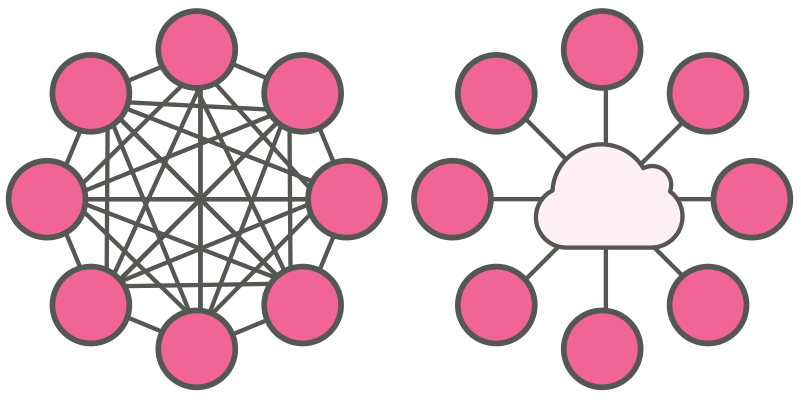

Alleen is maar alleen, en dat is ook zeker zo bij computers.

Als we verschillende computers met elkaar willen laten communiceren, 
dan moeten we ze op een of andere manier verbinden.

Elke computer met elke andere computer verbinden is niet haalbaar.
Beter is om alle computers te verdingen met gemeenschappelijk medium
waarover ze kunnen communiceren.

Dat is gemeenschappelijke medium is een netwerk.
Het is de rol van het besturingssysteem om de verschillende 
manieren om met een netwerk te verbinden te ondersteunen,
en de gebruiker toe te laten precies te configureren hoe
met het netwerk moet verbonden worden.

<Note>

In een latere les
zullen we uitgebreid aandacht besteden aan netwerken.

</Note>

