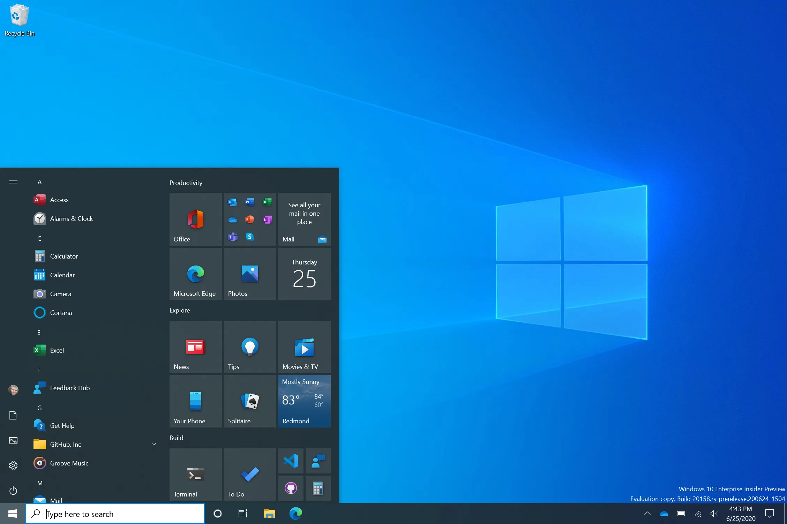
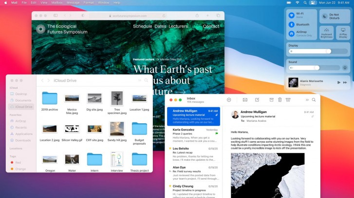
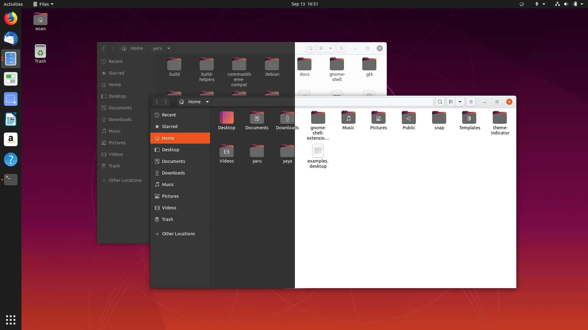

De gebruikersinterface of UI (user interface) is het een besturingssysteem
er uitziet voor ons als gebruikers.

Hier is een voorbeeld van de 3 voornaamste besturingssystemen voor desktops:

<Note>

In de volgende drie lessen zullen we dieper ingaan op elk van deze drie 
besturingssystemen. We zullen daarbij wat we geleerd hebben over computers
en besturingssystemen toetsen aan de praktijk.

</Note>

