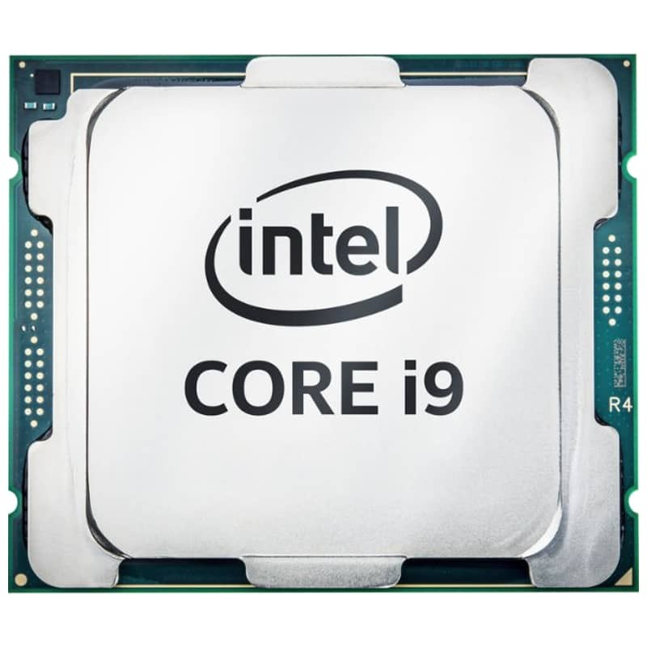

Een moderne computer bestaat uit talloze onderdelen, maar een aantal kern-
onderdelen kan je terugvinden in alle computers.

## De processor

### De CPU

De _processor_ of _CPU_ is het centrale brein van de computer dat de berekeningen of logische stappen uitvoerd.

Een processor heeft zelf ook nog verschillende delen die instaan voor een 
welbepaalde taak. Maar we kunnen de processor beschouwen als een _zwarte doos_
die het rekenwerk uitvoert.

<Note>

Hieronder enkele bekende fabrikanten van processors en waar hun produkten
meestal gebruikt worden:

 - **Intel**: Laptops en desktop computers
 - **AMD**: Laptops en desktop computers
 - **Qualcomm**: Smartphones en tablets
 - **Apple**: Apple producten

</Note>

### De GPU

Computers worden steeds krachtiger, maar de _processor_ blijft een _bottleneck_.
Dat is zeker zo voor het genereren van de _output_ van grafisch erg belastende
toepassingen, zoals games, video, en dergelijke.

Om de centrale processor een handje toe te steken hebben computers voor
consumenten nu ook vaak een processor die specifiek is gemaakt om te helpen
met de berekeningen voor graphics. De zogenaamde _GPU_.

<Note>

GPU's kan je terugvinden in computers voor consumenten omdat ze gebruikt worden
voor gaming en dergelijke.
Echter, GPUs zijn ook uitermate geschikt voor een beperkt aantal andere taken
zoals het mijnen van _bitcoin_ of het werken met _neurale netwerken_.

**Nvidia** is de meest bekende producent van GPUs.

</Note>

## Het geheugen of memory

Een computer gebruikt geheugen op dezelfde manier dat jij dat doet:

### Processor cache

Een klein aantal dingen kan je gewoon zo onthouden. In de computer is dit de _processor_ _cache_. 

Dit geheugen is bliksemsnel beschikbaar voor de processor, want het zit
rechstreeks in de processor ingebakken. Je hoeft er voor de rest niet van
wakker te liggen.

### Werkgeheugen

Een beperkt aantal dingen kan je op je hand schrijven. Dit is het zogenaamde werkgeheugen. Snel, handig, maar zogenaamd _volatiel geheugen_. Maw, als je de computer uitzet is het gewist. Net zoals dingen die op je hand staan slechts meegaan tot de volgende douche.

Het werkgeheugen of _RAM_ is het belangrijkste geheugen, en als we over geheugen
praten zonder meer, dan gaat het over het werkgeheugen

### Video geheugen

Zoals we al leerden bij [de processor](#de-processor) hebben veel systemen
tegenwoordig ook een _GPU_. Die heeft z'n eigen geheugen dat specifiek dient
ter ondersteuning van de _GPU_.

## Opslag of storage

Het geheugen is volatiel en dus blijft de informatie in het geheugen alleen
bestaan zolang de computer aan staat. Wanneer we informatie permanent willen 
opslaan doen we dat in de opslag of storage.

### Floppy disk

Ze worden nauwelijks nog gebruikt, maar het is goed om te weten dat ze bestaan.
Floppy disks zijn de USB-drives van vroeger.

### Harde schijf of hard drive

De meest voorkomende vorm van opslag is een _harde schijf_. De naam komt van
de vergelijking met een _floppy disk_ die in vergelijking veel minder hard zijn
dan harde schijven. 

In tegenstelling tot de floppy disk zit een harde schijf (typisch) vast in 
de computer en kunnen ze niet door de gebruiker gewisseld worden.

Klassiek is een harde schijf een collectie van metalen platen die snel in het
rond draaien. Een arm beweegt over de platen en magnetiseerd of demagnetiseerd
kleine stukjes van de plaat. Die representeren dan een `1` of een `0`.

### SSD of solid state drive

Since aan aantal jaren maakt de klassieke _harde schijf_ meer en meer plaats 
voor _SSD_ technologie. Dit is een harde schijf (niet echt meer een schijf maar
de term wordt wel gebruikt) die gebaseerd is op dezelfde technologie als een
USB-stick of thumb-drive.

Deze schijven hebben geen bewegende onderdelen, en zijn daardoor sneller dan
de klassieke harde schijven.

### USB drives

USB-drives zijn de floppy disks van vandaag: Snel wisselbare opslag om dingen
mee van thuis naar kantoor te zeulen. Of bestanden door te geven aan anderen.

### CD-ROM en DVD

Nu grotendeels uit de mode, maar ooit super populair: De CD-ROM en later de DVD.

### Tape

Nooit gebuikt door thuisgebruikers, maar nog steeds de absolute koning van de
backup: tape.

## Het moederbord

Al deze componenten los bij elkaar in een diepvrieszakje maken uiteraard 
geen computer. Het _moederbord_ is de hoofdcomponent in een computer waar je
alle andere onderdelen op aansluit.

