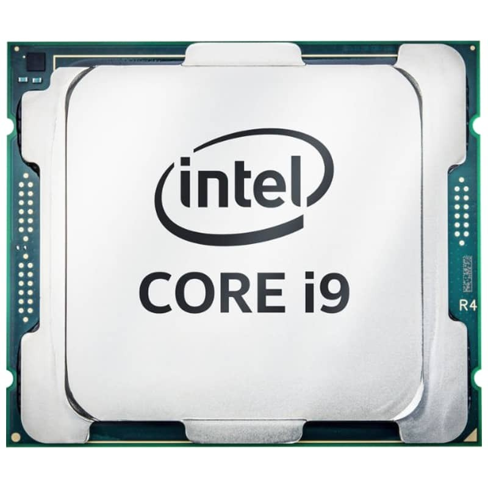

De _processor_ of _CPU_ is het centrale brein van de computer dat de berekeningen of logische stappen uitvoerd.

Een processor heeft zelf ook nog verschillende delen die instaan voor een 
welbepaalde taak. Maar we kunnen de processor beschouwen als een _zwarte doos_
die het rekenwerk uitvoert.

<Note>

Hieronder enkele bekende fabrikanten van processors en waar hun produkten
meestal gebruikt worden:

 - **Intel**: Laptops en desktop computers
 - **AMD**: Laptops en desktop computers
 - **Qualcomm**: Smartphones en tablets
 - **Apple**: Apple producten

</Note>

<Tip>

##### Multi-core processoren

Moderne processoren hebben vaak meerdere _cores_. 
Elk van die cores is een eigen mini-processor die zelfstandig berekeningen en operaties kan 
uitvoeren. Een computer met een multi-core processort heeft dus in zekere zin meerdere 
processoren (die allemaal in dezelfde processor-chip zitten).

</Tip>

