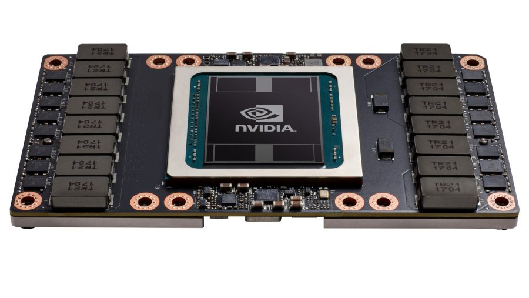

Computers worden steeds krachtiger, maar de _processor_ blijft een _bottleneck_.
Dat is zeker zo voor het genereren van de _output_ van grafisch erg belastende
toepassingen, zoals games, video, en dergelijke.

Om de centrale processor een handje toe te steken hebben computers voor
consumenten nu ook vaak een processor die specifiek is gemaakt om te helpen
met de berekeningen voor graphics. De zogenaamde _GPU_.

<Note>

GPU's kan je terugvinden in computers voor consumenten omdat ze gebruikt worden
voor gaming en dergelijke.
Echter, GPUs zijn ook uitermate geschikt voor een beperkt aantal andere taken
zoals het mijnen van _bitcoin_ of het werken met _neurale netwerken_.

**Nvidia** is de meest bekende producent van GPUs.

</Note>
