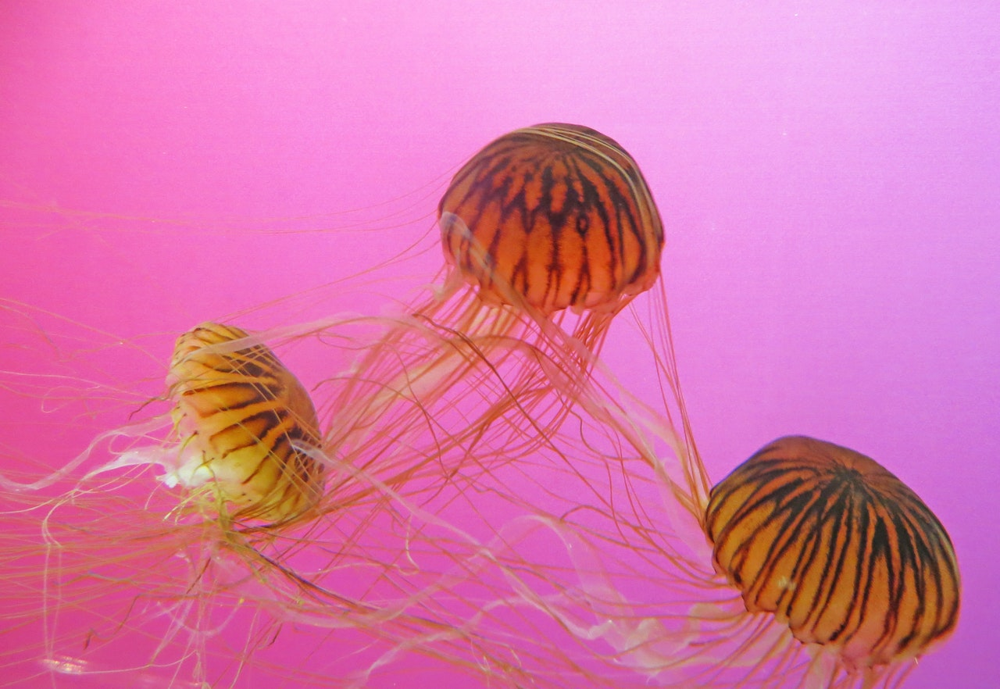
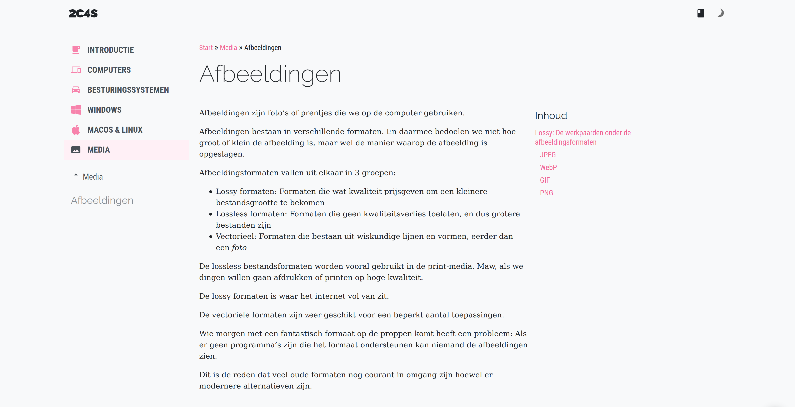

Afbeeldingen zijn foto's of prentjes die we op de computer gebruiken.

## Rasterformaat en vectoriele formaten

Afbeeldingen bestaan in zogenaamd _rasterformaat_ en _vectorieel formaat_.
Afbeeldingen in rasterformaat bestaan uit pixels. Afbeeldingen in vectorieel
formaat beschrijven de afbeelding aan de hand van lijnen, curves en andere
basisvormen.

## Over pixels, dots, resolutie, en DPI

Een pixel of is het kleinste wat we kunnen tonen
op een computerscherm (of kunnen printen met een printer).

Als we over schermen praten, dan gebruiken we pixel. Dot (of punt) wordt meer
gebruikt als we het over printen hebben.

Afbeeldingen in rasterformaat slaan de informatie van de afbeelding op in rijen en
kolommen van pixels.

Vectoriele afbeeldingen doen dat niet, maar als we ze op het scherm tonen is de
kwaliteit nog steeds afhankelijk van het aantal pixels op het scherm.

Het aantal pixels dat we op het scherm kunnen tonen noemen we de resolutie.
Het is altijd een horizontaal x verticaal aantal pixels.

De resolutie van een HD televisie of computerscherm is 1920 × 1080.  
De resolutie van een 4K televisie of computerscherm is 3840 x 2160.

Een 4K scherm heeft dus 4x zoveel pixels als een HD scherm.

De pixelsdensiteit -- de hoeveelheid pixels per centimeter -- is ook een 
belangrijke factor. Een HD televisie van 40cm heeft immers dezelfde
resolutie als een HD televisie van 80cm. Met andere woorden het zelfde
aantal pixels is verspreid over een grotere afstand. Het resultaat zijn
grotere pixels.

Voor televisies speelt dat niet zoveel rol, want in principe zit je gewoon
verder van een grotere televisie zodat 'ie er wat kleiner uitziet.

Maar de pixel densiteit is wel erg belangrijk bij telefoons en andere 
schermen waar je korter bij zit.

De pixeldensiteit noemen de de _DPI_ van een scherm, of de _Dots Per Inch_ 
of dots (pixels) per inch (een inch is 2.54cm).

De moderne smartphones hebben DPI waardes tot 485. Met andere woorden, op
1 inch (25.4mm) zitten 485 pixels. Elke pixel is dus 25.4/485 of net iets
meer dan een 0.05mm. Op zo'n scherm wordt het erg moeilijk om met het blote
ook nog pixels te zien.

Bij printers ligt the DPI nog hoger, en moderne laserprinters kunnen vaak
2400 DPI printen. Elke _dot_ is dan ongeveer een honderste van een millimeter.

## Additieve en subtractieve kleuren

Computerschermen werken met een zogenaam additief kleurenmodel.
Dat wil zeggen dat de verschillende kleuren frequenties van licht worden samen
gebundeld om een kleur te vormen.

We gebruiken daarvoor het zogenaamde RGB model, voor Rood, Groen, en Blauw (red/green/blue)
omdat onze ogen receptors hebben voor deze 3 primaire kleuren.

Een computerscherm kan in elke pixel een rode, groene, en blauwe kleur uitstralen,
en deze combineren.  Rood en blauw geeft paars, enzoverder. 

Dit model is gebaseerd op gekleurd licht.
Het gevolg daarvan is dat als je alle kleuren op nul zet, je pikzwart krijgt.
Als je alle kleuren maximaal zet, dan krijg je zuiver wit.

Bij printers werkt dit niet. Als je alle kleuren maximaal zet bij een printer krijg
je uiteraard geen wit. En geen kleuren is ook geen zwart.

Printers gebruiken het tegenovergestelde, het zogenaamd subtractief kleurenmodel.
Het meest gebruikte is het zogenaamde CMYK model:

 - C: Cyan (flets blauw), het tegenovergestelde van rood in het kleurenspectrum
 - M: Magenta (fel roze), het tegenovergestelde van groen in het kleurenspectrum
 - Y: Yellow (geel), het tegenovergestelde van blauw in het kleurenspectrum
 - K: Key. Zwart omdat puur zwart moeilijk te maken is door het mengen van andere kleuren

Als we naar een geprinte afbeelding kijken, dan zien we niet meteen het licht
dat wordt uitgestraald door ons computerscherm, maar de weerkaatsing van het omgevingslicht.
Daarom zijn de CMYK kleuren gebaseerd op de kleuren die rood, groen, en blauw absorberen,
eerder dan uitstralen.

Omdat het moeilijk is om puur zwart te drukken is er een 4e primaire kleur die puur zwart is.
Voor wit printen we gewoon niks.

## Kleurdiepte

De bestandsgrootte van een afbeelding in rasterformaat is afhankelijk van 
het aantal pixels in de afbeelding. Met andere woorden, van de resolutie.

Elke pixel krijgt een kleur en eventueel een transparantie, wat men
het _alpha channel_ noemt. De kleur zelf wordt opgeslagen in een aantal
bits. Hoeveel bits men gebruikt noemt men de _color depth_ (kleur diepte)
en bepaald verschillende kleuren in de foto kunnen bestaan.

Typish is een kleurdiepte van 24bits (zogenaamd True Color).
We gebruiken het zogenaamd _RGB_ model met 8 bits voor groen,
8 bits voor rood en 8 bits voor blauw. 8 bits kunnen 256 verschillende waarden
bevatten, dus hebben we 256 * 256 * 256 kleuren, of ongeveer 16.7 miljoen kleuren.

Als we ook transparantie willen hebben we 8 extra bits nodig (32bit kleurdiepte)
zodat we ook 256 verschillende transparantie waarden hebben in elke pixel.

Een kleurdiepte van 1 bit laat slechts 2 kleuren toe. Dit is een zwart/wit afbeelding.
Niet te verwarren met een kleurdiepte van 8 bit dit 256 grijswaarden toelaat. Dit
is een zogenaamde _grayscale_ afbeelding, en waar we aan denken als we horen _zwart/wit foto_.

## Kleuren op het web, van #000000 tot #FFFFFF

Op het web gebruiken we het RGB model met een kleurendiepte van 24 bit met 8 bit transparantie.

Dat wil zeggen:

 - 8 bits voor Rood
 - 8 bits voor Groen
 - 8 bits voor Blauw
 - (eventueel) 8 bits voor transparantie of het zogenaamde alpha channel

8 bits kunnen we schrijven als `00000000` maar dat neemt nogal veel plaats in.
Daarom gebruiken we het hexadecimaal talstelsel. Da's net zoals het 10-delige
talstelsel dat we gewoon zijn, alleen gebruiken we 16 als basis:

 - 0: 0
 - 1: 1
 - 2: 2
 - 3: 3
 - 4: 4
 - 5: 4
 - 6: 6
 - 7: 7
 - 8: 8
 - 9: 9
 - A: 10
 - B: 11
 - C: 12
 - D: 13
 - E: 14
 - F: 15

Met dit talstelsel kunnen we 256 waarden in 2 vakjes proppen (16 * 16), dus nu kunnen 
we 8 bits (`00000000`) schrijven als `00`.
Als we rood, groen, en blauw aan elkaar plakken krijgen we `000000`, en de conventie is
dat we daar een `#` voorzetten: `#000000` is zwart.

Waarom zwart? Omdat alle kleuren _op nul staan_ wat zwart geeft.

Het maximum dat we een kleur kunnen geven is `FF`. Dus:

 - `#FF0000` is rood
 - `#00FF00` is groen
 - `#0000FF` is blauw

Maar we kunnen uiteraard zoveel mengen als we willen.

<Tip>Als alle kleuren dezelfde waarde hebben krijg je altijd een grijswaarde.</Tip>

Deze manier om kleuren weer te geven is de meest gebruikte op het internet.
Er zijn er anderen, maar we komen hier later uitgebreid op terug.

# Lossy vs lossless

De meest gebruikte afbeeldingsformaten zijn de rasterformaten.
We weten al dat die bestaan uit rijen een kolommen van pixels die elk een kleur en optioneel
een transparantie hebben. We weten ook dat we de kleurdiepte kunnen beperken of uitbereiden.

We hebben dus een heel aantal informatie dat we moeten opslaan om de foto te kunnen weergeven.
Er zijn twee manieren om dat te doen:

 - lossless formaten slaan alle informatie op om de afbeelding pefect te reconstrueren
 - lossy formaten slaan niet alle informatie op om een benadering van de afbeelding te reconstrueren

Bestandsformaten voor lossless afbeeldingen worden gebruikt in de druk en fotografie wereld.
Fotografen werken vaak met _RAW_ bestanden, en drukkers met _TIFF_ bestanden.

BMP (bitmap) een oud Microsoft formaat is ook een lossless bestand.

Maar op het internet hebben we liever een kleiner bestand dat de afbeelding goed benaderd,
dan een enorm bestand dat wat beter is. Daarvoor gebruiken we lossy formaten, zoals JPG,
GIF, of PNG.

## Lossy formaten voor afbeeldingen

Dit zijn de afbeeldingen die je overal op het internet tegenkomt.

### JPEG

Een JPEG bestand heeft een `.jpg` of `.jpeg` extentie en is uitermate geschikt voor foto's.

JPEG heeft een variabele compressie factor die je hoger of lager kan instellen.
Meer compressie geeft een kleinere bestandsgrootte, maar ook een verlies aan kwaliteit.

Wat je moet weten is dat JPEG voor foto's is en geen transparentie ondersteund.
Het is een relatief oud formaat (sinds 1992), en worst stilaan vervangen door WEBP.

### WebP

WebP is een nieuwer formaat (sinds 2010). WebP is moeilijk in een hokje te stoppen
omdat het zowel lossless als lossy compressie ondersteund.

Echter, het is voldoende om te onthouden dat WebP een modernere versie van JPEG is.
Al heeft het wel meer mogelijkheden, zoals ondersteuning voor transparantie.

### GIF

GIF is een erg oud formaat (1987) maar is nog steeds erg geliefd omdat het animatie ondersteund.

GIF animaties maak je door verschillende afbeeldingen die een klein beetje verschillen kort
na elkaar weer te geven. Het gevolg daarvan is dat een GIF animatie een erg groot bestand
vormt.

Dit is ook de reden dat veel online diensten (zoals Twitter bijvoorbeeld) GIF bestanden die 
hun gebruikers uploaden automatisch omzetten naar video bestanden.

GIF gebruikt een geindexeerde kleurenpalet, en ondersteund transparantie.
Een geindexeerde kleurenpalet wil zeggen dat het bestand slechts een beperkt aantal kleuren zal bevatten.

Daardoor is GIF niet geschikt voor fotos, maar wel voor logo's en dergelijke.
Maar zelfs daarvoor gebruiken we vandaag de dag PNG, dus GIFs bestaan eigenlijk alleen nog
omdat het een bewegend formaat is dat overal ondersteund wordt.

### PNG

PNG is het formaat voor logo's an vele andere dingen. Zowat alles behalve foto's of dingen
die moeten bewegen.

PNG ondersteund ook transparantie, wat handig is voor logo's en dergelijke.
Al is het vaak beter om hiervoor SVG te gebruiken.

## Vectoriele bestanden

Vectoriele bestanden beschrijven een afbeelding aan de hand van geometrische vormen, lijnen,
en curves. Ze gebruiken dus geen pixels, maar beschrijven wat er in de afbeelding moet getoond
worden, zodat de computer precies kan berekenen hoe de dingen er uit moeten zien.

Het gevolg is dat je op een SVG afbeelding zover kan inzoomen als je wil, het resultaat
blijft altijd scherp.

SVG is niet geschikt voor foto's maar uitermate geschikt voor logo's en dergelijke.

SVG ondersteund ook animaties en zelfs Javascript, wat ook meteen de reden is dat je
het vaak niet kan uploaden op sites als Facebook, Twitter, enzoverder.

Voor wie aan de slag wil als webontwikkelaar is SVG iets waar je zeker een basiskennis
van moet opdoen, en we zullen er dan ook op terugkomen in een latere les.

