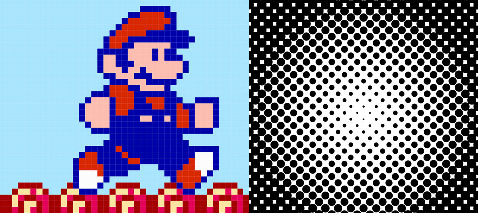

Een pixel of is het kleinste wat we kunnen tonen
op een computerscherm (of kunnen printen met een printer).

<Tip>

##### Pixels en dots niet helemaal hetzelfde

Als we over schermen praten, dan gebruiken we pixel. Dot (of punt) wordt meer
gebruikt als we het over printen hebben.

</Tip>

##### Resolutie

Afbeeldingen in rasterformaat slaan de informatie van de afbeelding op in rijen en
kolommen van pixels.

Het aantal pixels dat we op het scherm kunnen tonen noemen we de resolutie.
Het is altijd een horizontaal x verticaal aantal pixels.

De resolutie van een HD televisie of computerscherm is 1920 × 1080.  
De resolutie van een 4K televisie of computerscherm is 3840 x 2160.

Een 4K scherm heeft dus 4x zoveel pixels als een HD scherm.

##### Pixeldensiteit of DPI

De pixelsdensiteit -- de hoeveelheid pixels per centimeter -- is ook een 
belangrijke factor. Een HD televisie van 40cm heeft immers dezelfde
resolutie als een HD televisie van 80cm. Met andere woorden het zelfde
aantal pixels is verspreid over een grotere afstand. Het resultaat zijn
grotere pixels.

Voor televisies speelt dat niet zoveel rol, want in principe zit je gewoon
verder van een grotere televisie zodat 'ie er wat kleiner uitziet.

Maar de pixel densiteit is wel erg belangrijk bij telefoons en andere 
schermen waar je korter bij zit.

De pixeldensiteit noemen de de _DPI_ van een scherm, of de _Dots Per Inch_ 
of dots (pixels) per inch (een inch is 2.54cm).

De moderne smartphones hebben DPI waardes tot 485. Met andere woorden, op
1 inch (25.4mm) zitten 485 pixels. Elke pixel is dus 25.4/485 of net iets
meer dan een 0.05mm. Op zo'n scherm wordt het erg moeilijk om met het blote
ook nog pixels te zien.

Bij printers ligt the DPI nog hoger, en moderne laserprinters kunnen vaak
2400 DPI printen. Elke _dot_ is dan ongeveer een honderste van een millimeter.

