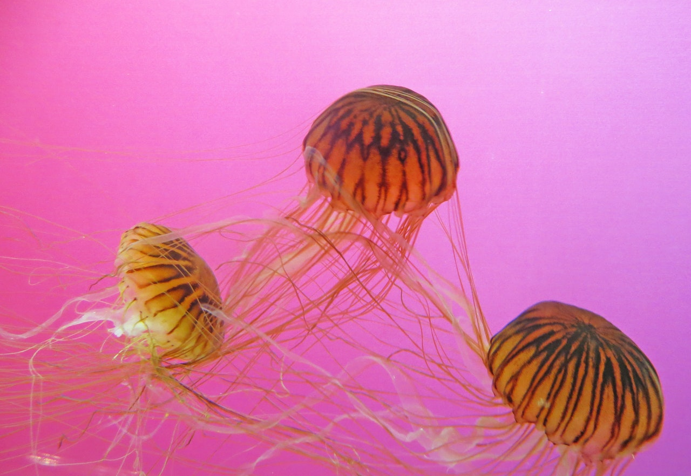
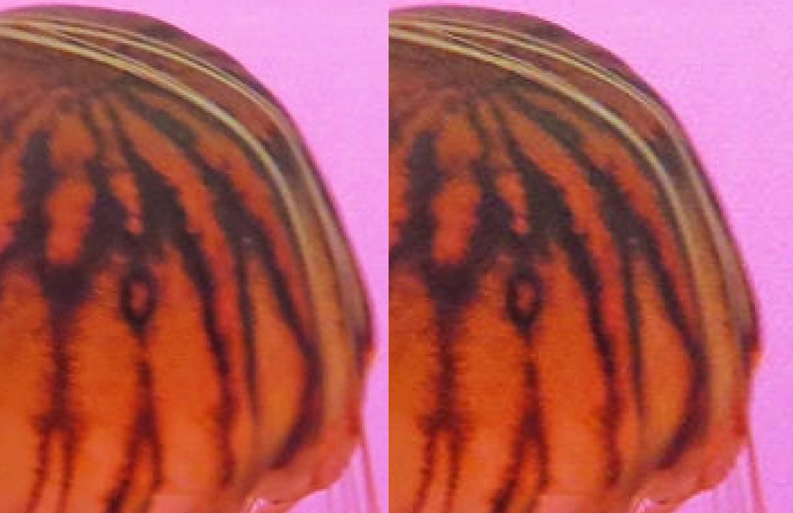

Een JPEG bestand heeft een `.jpg` of `.jpeg` extentie en is uitermate geschikt voor foto's.

JPEG heeft een variabele compressie factor die je hoger of lager kan instellen.
Meer compressie geeft een kleinere bestandsgrootte, maar ook een verlies aan kwaliteit.

Wat je moet weten is dat JPEG voor foto's is en geen transparentie ondersteund.
Het is een relatief oud formaat (sinds 1992), en worst stilaan vervangen door WEBP.

