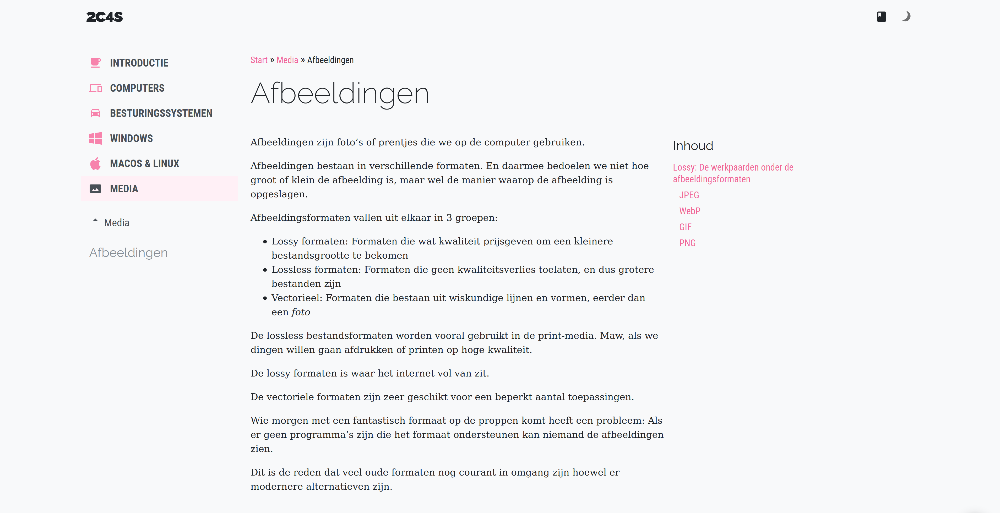

PNG is het formaat voor logo's an vele andere dingen. Zowat alles behalve foto's of dingen
die moeten bewegen.

PNG ondersteund ook transparantie, wat handig is voor logo's en dergelijke.
Al is het vaak beter om hiervoor SVG te gebruiken.

