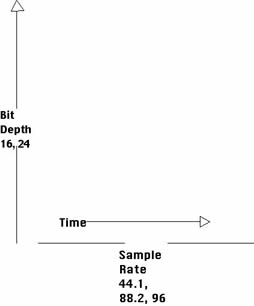

Audio bestanden hebben geen pixels, maar we zitten daar met een gelijkaardig
probleem: Hoe kunnen we de analoge wereld van geluid omzetten naar de digitale
wereld van de computer.

Het antwoord: sampling:

Signal sampling (het samplen, of _proeven_ van een signaal) is iets wat zowat
overal gebeurd waar we een analoog signaal (een golf) willen omzetten in een
digitaal signaal.

We geen gewoon op verschillende punten meten wat de waarde van de golf is
op dat moment, en dat laat ons toe om een benadering van de originele golf
te reconstrueren.

## Bit depth, sample rate, en bit rate

Net zoals we bij afbeeldingen een bit depth (kleurendiepte)
en een resolutie hebben, hebben we bij audio bestanden eigenlijk krak hetzelfde:

 - Bit depth: Hoeveel verschillende waarden we voor het geluid kunnen hebben in 1 meetpunt
 (net zoals kleurdiepte)
 - Sample rate: Hoeveel keer (per seconde) dat de audio wordt gesampled

Beiden samen vormen de zogenaamde bit rate, wat gewoon een indicatie is van de
hoeveelheid informatie per seconde. Moderne formaten ondersteunen een zogenaamde
variable bitrate. Daarbij is de sample rate afhankelijke van de inhoud. Zo kan
er minder gesampled worden als dat niet nodig is (bijvoorbeeld bij een stille
passage) en is de bit rate lager en dus het bestand kleiner.

## Lossy vs lossless

Net zoals bij afbeeldingen zijn er ook bij audio lossy en lossless bestanden.

Lossless bestanden geven de originele samples exact week. Lossy bestanden
geven een benadering om te besparen op de bestandsgrootte.

## Codecs en containers

De manier waarop een audio (of video) bestand de gevens opslaat noemen we
een _codec_. Een codec is enkel en alleen begaan met het opslaan van de 
sample waardes op een zo efficient mogelijke manier.

Een container, is een soort van verpakking die de data van de codec opslaat
samen met wat andere dingen zoals meta-informatie (titels enzoverder).

<Note>
Strikt genomen hebben afbeeldingsbestanden ook containers, maar daar zijn
we niet op ingegaan.
</Note>

Codecs en containers worden vaak door elkaar genoemd, maar het is goed om
te weten dat er een verschil is. Zo is een MP3 audiobestand en een MP4 video
bestand beiden de `MP` omdat ze hetzelfde `MPEG` container formaat gebruiken.

## Lossless formaten

Lossless formaten is iets voor mensen met dure hifi installaties.
De belangrijkste zijn:

 - WAV: Wat speciaal want het is een niet gecomprimeerd bestand. 
        Strikt genomen is WAV een container formaat. Doordat het niet
        gecomprimeerd is is het een uitstekend formaat voor audio bewerking
        maar de grote bestanden maken het ongeschikt voor het internet.
 - FLAC: Free Lossless Audio Codec (gebruikt door iedereen)
 - ALAC: Apple Lossless Audio Codec (gebruikt door Apple)

Als je ooit een lossless formaat moet kiezen, kies dan FLAC

## Lossy formaten

 - MP3: Een MPEG container met een Layer III audio track (populair bij de computerleken)
 - OGG: Een Ogg container met een Vorbis audio track (populair bij nerds)
 - AAC: iTunes muziek is in dit formaat

Als je ooit een lossless formaat moet kiezen, kies dan MP3

