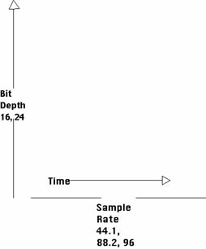

Net zoals we bij afbeeldingen een bit depth (kleurendiepte)
en een resolutie hebben, hebben we bij audio bestanden eigenlijk krak hetzelfde:

 - **Bit depth**: Hoeveel verschillende waarden we voor het geluid kunnen hebben in 1 meetpunt
 (net zoals kleurdiepte)
 - **Sample rate**: Hoeveel keer (per seconde) dat de audio wordt gesampled

Beiden samen vormen de zogenaamde **bit rate**, wat gewoon een indicatie is van de
hoeveelheid informatie per seconde. Moderne formaten ondersteunen een zogenaamde
variable bitrate. Daarbij is de sample rate afhankelijke van de inhoud. Zo kan
er minder gesampled worden als dat niet nodig is (bijvoorbeeld bij een stille
passage) en is de bit rate lager en dus het bestand kleiner.
