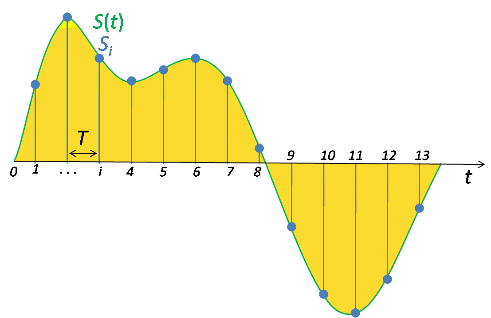

Audio bestanden hebben geen pixels, maar we zitten daar met een gelijkaardig
probleem: Hoe kunnen we de analoge wereld van geluid omzetten naar de digitale
wereld van de computer.

Het antwoord: sampling

Signal sampling (het samplen, of _proeven_ van een signaal) is iets wat zowat
overal gebeurd waar we een analoog signaal (een golf) willen omzetten in een
digitaal signaal.

We geen gewoon op verschillende punten meten wat de waarde van de golf is
op dat moment, en dat laat ons toe om een benadering van de originele golf
te reconstrueren.

<ReadMore list />
