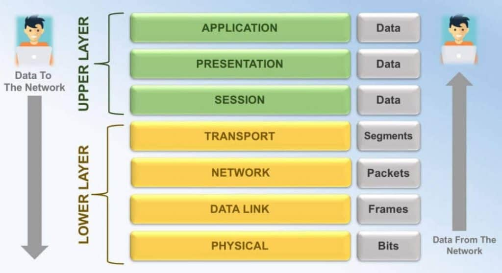

Netwerk technologie is gebaseerd op het zogenaamde _OSI_ model,
wat staat voor Open Systems Interconnect.

Het OSI model is een theoretisch model dat uit de doeken
doet hoe computers met elkaar kunnen praten over een netwerk.

Het werd ontwikkeld in de jaren 70, en is dus zo oud als de straat, 
maar de principes van het OSI-model vinden we vandaag terug in IP,
al is het dan een vereenvoudigde versie.

##### Allemaal laagjes vormen de network stack

De basis van het OSI-model zit'em in de laagjes.
Elke laag heeft zijn eigen taak:

| Nr | Naam | Voorbeeld protocol |
| -- | ---- | ------------------ |
|  7 | Application layer | HTTP, FTP, DNS, SMTP, SSH |
|  6 | Presentation layer | SSL, TLS |
|  5 | Session layer | Netbios, PPTP |
|  4 | Transport layer | TCP, UDP |
|  3 | Network layer | IP, ARP, ICMP, IPSec |
|  2 | Data link layer | Ethernet, PPP |
|  1 | Physical layer | Ethernet, USB, Bluetooth |

De lagen allemaal op elkaar gestapeld vormt een zogenaamde _network stack_
of _netwerk stapel_ al wordt die term nooit vertaald.

Het idee is dat de meest fundamentele lagen de basis vormen onderaan,
en dat meer geavanceerde lagen op deze basis verderbouwen om meer 
complexe dingen te doen.

Helemaal onderaan vinden we de fysieke laat die vastlegd hoe breed een ethernet
connector moet zijn, of hoeveel volt precies de signalen moeten zijn en andere
dingen die de fundamentele bouwstenen vormen van hoe er fysiek moet gecommuniceerd worden.

Helemaal bovenaan, laag zeven, is de applicatie laag die de meest geavanceerde dingen doet
zoals controleren of er nieuwe tweets zijn sinds de pagina de laatste keer ververst is.

Wanneer twee computers met elkaar praten, dan wordt de informatie doorgegeven van de hogere
lagen naar de lagere, waarbij elke laag toevoegd wat 'ie moet.
Dan wordt de hele handel over het netwerk gestuurd waar het wordt opgepikt door de ondeste laag
van de bestemmeling, en maakt het z'n weg omhoog doorheen de lagen waarbij elke laag weer z'n ding doet.

Elke laag is dus alleen bezig met z'n eigen verantwoordelijkheid. Laag 7 heeft geen flauw idee van
hoe je nu precies een andere computer kan bereiken over het netwerk, terwijl laag 1 geen flauw benul
heeft van wat HTTP is.

