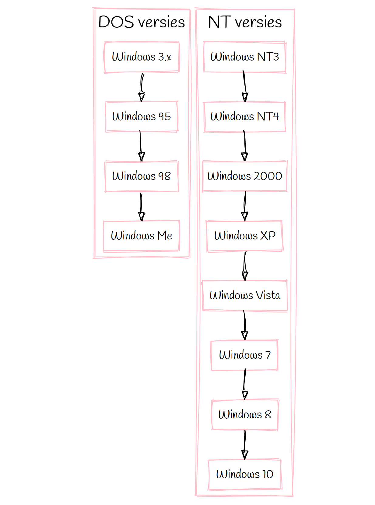

<Goals>

 - Binnen Windows de gegevens van de processor, het geheugen, en de opslag tonen
 - Gebruikers aanmaken binnen Windows
 - De belangrijkste locaties of mappen schetsen
 - De command of DOS prompt starten en basis commando's uitvoeren
 - De powershell prompt starten en basis commando's uitvoeren
 - Het start menu en configuratiescherm vinden
 - De registry-beheerder openen
 - De netwerkconfiguratie weergeven

</Goals>

Microsoft Windows is ongetwijfeld het besturingssysteem dat het meest 
bekend is bij de doorsnee gebruiker. Het is ook het meest populaire
besturingssysteem voor desktop gebruikers.

## Historiek

Er zijn heel wat Windows versies, and sommige van die versie zijn verdere
familie dan andere. Windows voor specifieke doelgroepen zoals IoT of telefoons
laten we even buiten beschouwing. Daarnaast is er windows voor servers, en de 
'gewone' windows.:

De stambook van de _gewone_ Windows ziet or zo uit:

De eerste versies waren een grafische interface bovenop DOS: het Disk Operating System.
Maw de kernel was een deel van DOS, en niet van Windows. Windows was gewoon een programma
dat je uitvoerde bovenop het besturingssysteem: DOS.

De NT-versies van Windows zijn degenen die we vandaag de dag gebruiken. 
Met Windows 10 als de meest recente versie. Op servers is Windows Server 2019 de meest
recente versie.

## UI

In Windows kan je de meeste dingen via de UI doen. Via de grafische interface.
Veel dingen kan je zelfs alleen via de grafische interface doen, wat bij andere
besturingssystemen vaak anders is.

Bij Windows is de UI nauw vervlochten met het OS. Je kan niet of nauwelijks zonder.

De belangrijkste onderdelen van de interface zijn:

 - De taakbalk en het start menu
 - De desktop
 - De verkenner

## Labo

In dit labo gaan we de lessen die we tot op heden geleerd toetsen een de praktijk.
En dan meer bepaald aan Windows.

Concreet gaan we de volgende oefeningen doen:

 - Opstarten van Windows
 - Aanmelden, opties voor taal en gebruikers
 - De desktop
 - De taakbalk en het start menu
 - De system tray
 - De mappen structuur van Windows, en de belangrijkste mappen
 - De structuur op de harde schijf tegenover de structuur die aan de gebruiker wordt getoont
 - Het configuratiescherm
 - De registry-editor
 - De DOS prompt
 - De Powershell prompt
 - Toetsencombinaties met de Windows key
 - Services
 - Taken en processen in het taakbeheer
