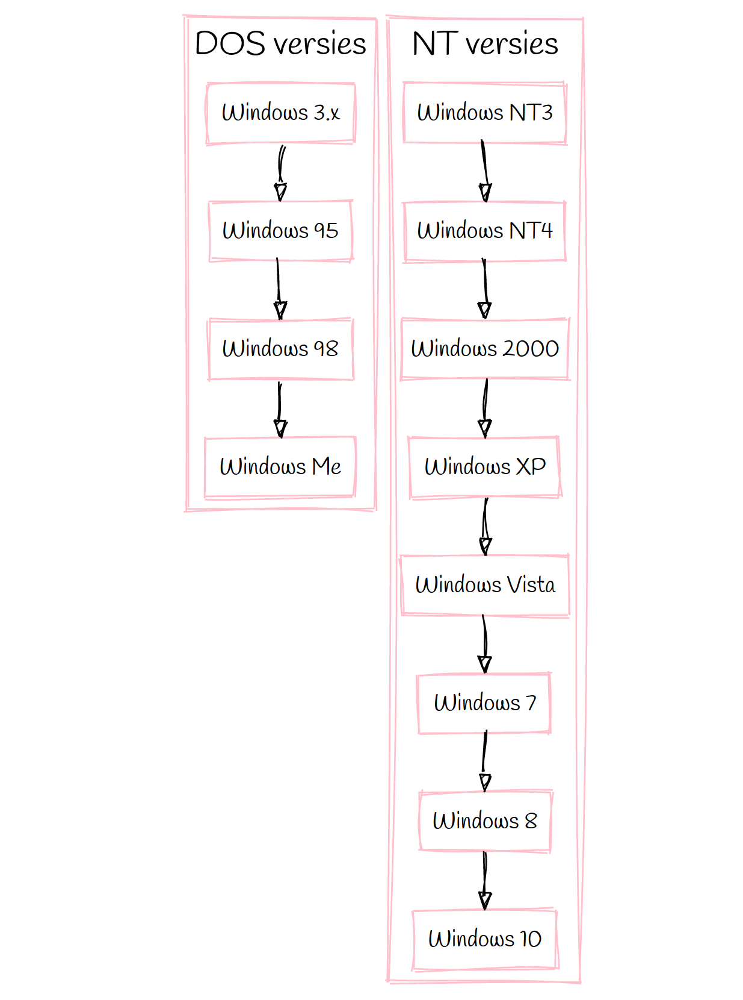

Er zijn heel wat Windows versies, and sommige van die versie zijn verdere
familie dan andere. Windows voor specifieke doelgroepen zoals IoT of telefoons
laten we even buiten beschouwing. Daarnaast is er windows voor servers, en de 
'gewone' windows.:

De stambook van de _gewone_ Windows ziet or zo uit:

De eerste versies waren een grafische interface bovenop DOS: het Disk Operating System.
Maw de kernel was een deel van DOS, en niet van Windows. Windows was gewoon een programma
dat je uitvoerde bovenop het besturingssysteem: DOS.

De NT-versies van Windows zijn degenen die we vandaag de dag gebruiken. 
Met Windows 10 als de meest recente versie. Op servers is Windows Server 2019 de meest
recente versie.

